# Pictionary GPT

## Overview

Need to hone your pictionary skills? Searching for a training partner that 
won't get tired when prepping all night for the big tournament? Well look no 
further because ChatGPT is in your corner! With the combined power of `gpt-4o`, 
OpenAI's latest LLM, and **[gfx](https://github.com/tonybillings/gfx)**, the 
premier graphics library for Go, you will become the pictionary pro you were 
always meant to be but without the hassle and expense of those year-long training 
camps. So forget about needing that passport and five thousand dollar deposit...an 
OpenAI API key is all you'll need*!  


_<sup>*Charges may apply</sup>_

## Prerequisites

As mentioned, you will need an **[API Key](https://openai.com/api/)**, NOT a 
ChatGPT Plus subscription, in order to use the app. As is typically the practice, 
the key should be used to set the `OPENAI_API_KEY` environment variable. In other 
words, this command should reveal the value for the key:  
```shell 
echo $OPENAI_API_KEY
```

Also as mentioned in the Overview, this app depends on **[gfx](https://github.com/tonybillings/gfx)** 
and in fact is nothing more than an exceptionally thin extension of the 
[example](https://github.com/tonybillings/gfx/tree/main/examples/ui) it includes 
demonstrating the `Canvas` control. As such, it inherits the same 
[prerequisites](https://github.com/tonybillings/gfx?tab=readme-ov-file#prerequisites) 
as the module.

## Usage

### Practice Mode

Just draw and ChatGPT will keep guessing!  Note that it will guess at an interval 
based on the `gptGuessIntervalSec` parameter (defaults to `5` seconds) and 
depending on whether you set the detail level to high or low, the token cost 
will either be around 800 or 100 (respectively) for each guess.  To change the 
detail level, set the `gptGuessAbility` parameter to `openai.ImageURLDetailHigh` 
or `openai.ImageURLDetailLow` (which is the default and seems to work well enough). 

### Game Mode

Ready to put your paint skills to the test? Choose a Difficulty level and 
ChatGPT will challenge you to draw an object that must be recognized by, well, 
another ChatGPT. Did I mention there's a time limit and your brush uses ink 
tanks that must be refilled?  

| Difficulty |                         Correct Color                         |                                                       Correct Object                                                       |                                                                               Correct Color<br/>& Object                                                                                | 
|------------|:-------------------------------------------------------------:|:--------------------------------------------------------------------------------------------------------------------------:|:---------------------------------------------------------------------------------------------------------------------------------------------------------------------------------------:|  
| **Easy**   |  |  |  |  
| **Normal** |  |  |  |
| **Hard**   |      |          |              |


## Screenshots

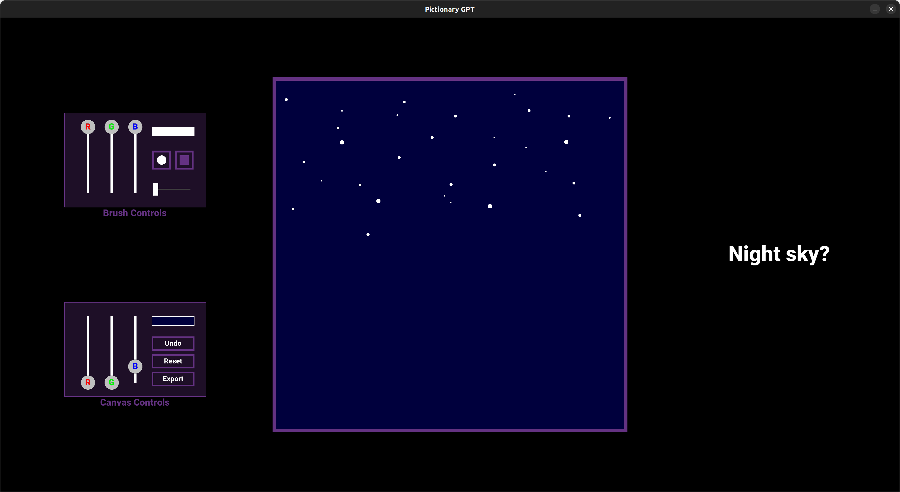  

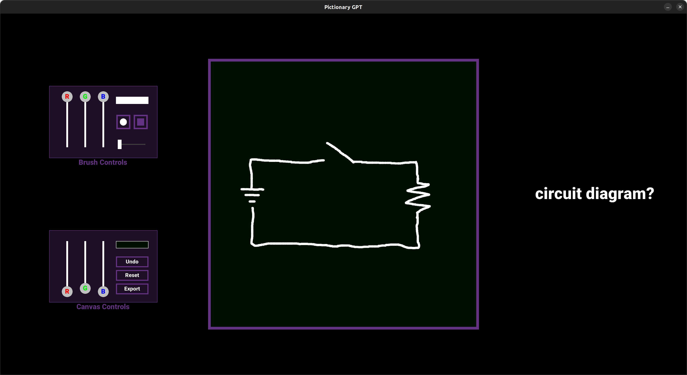  

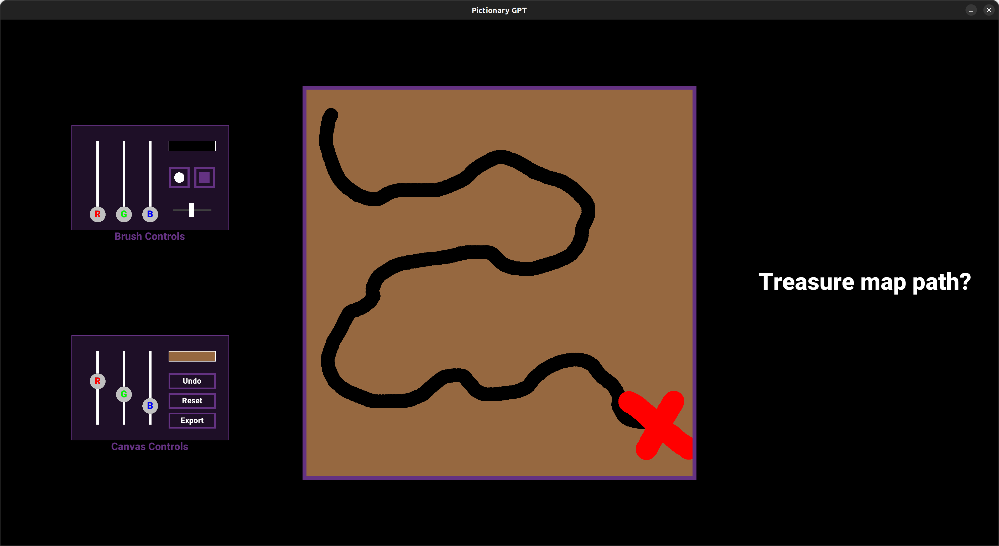  

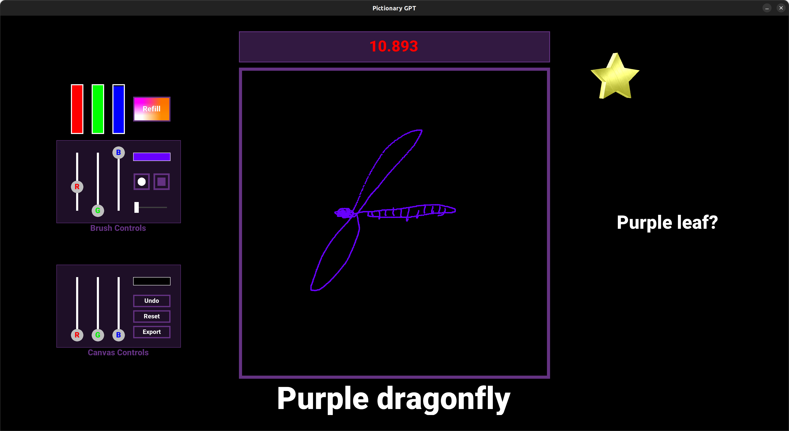  

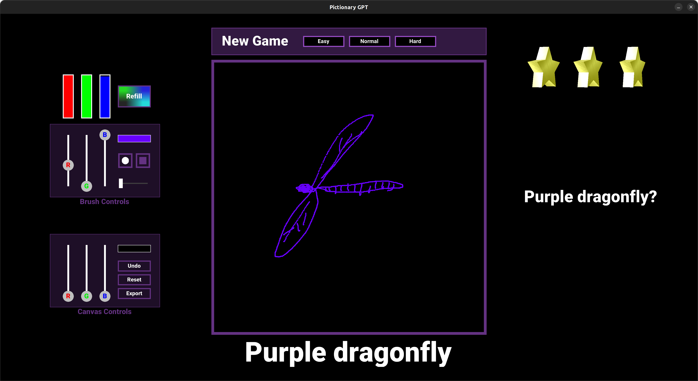  

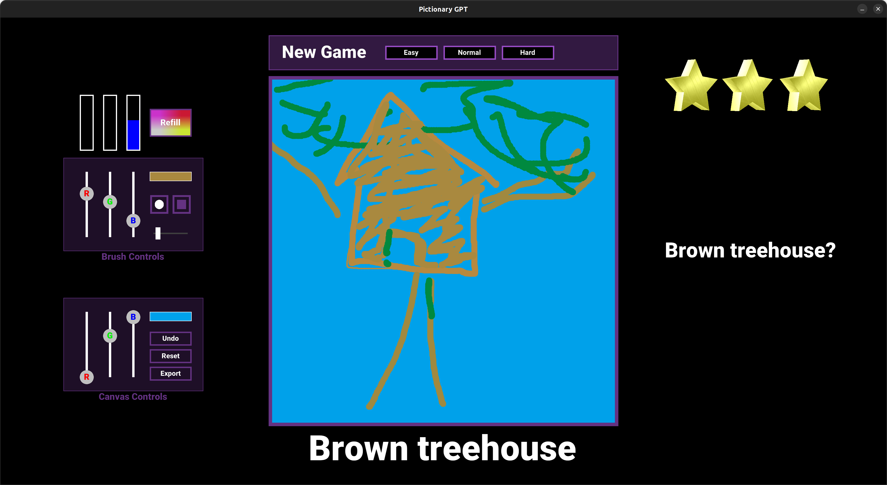  

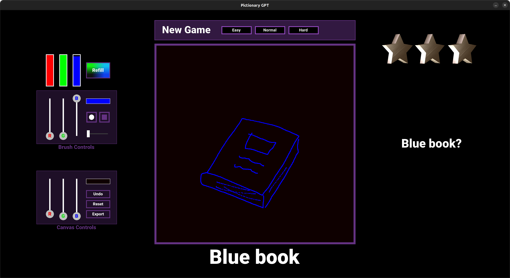  

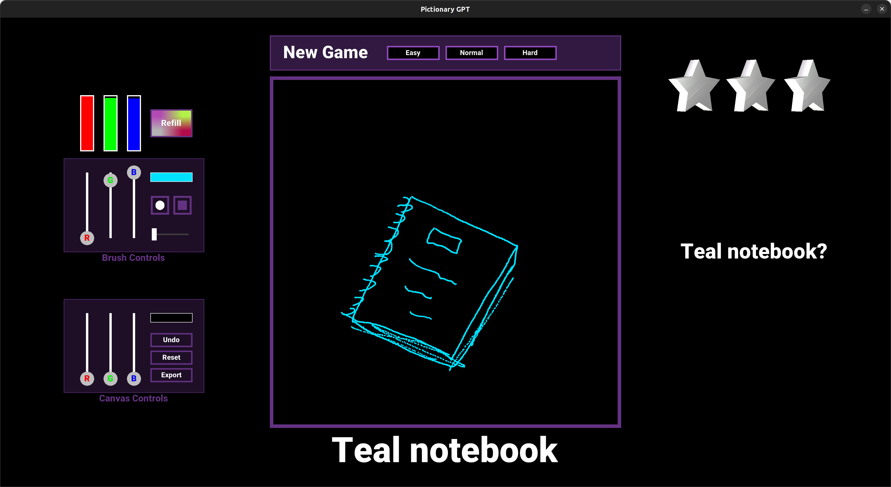  

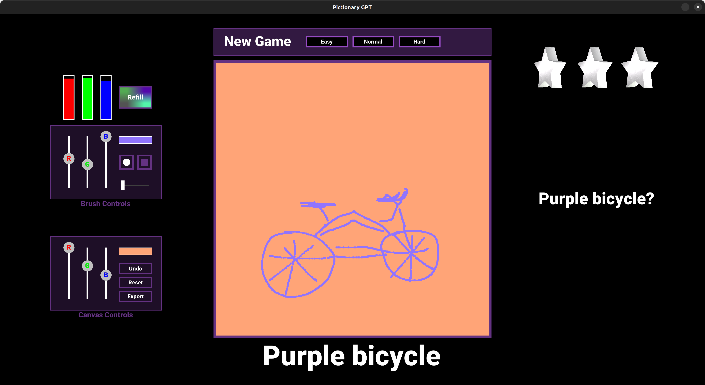  

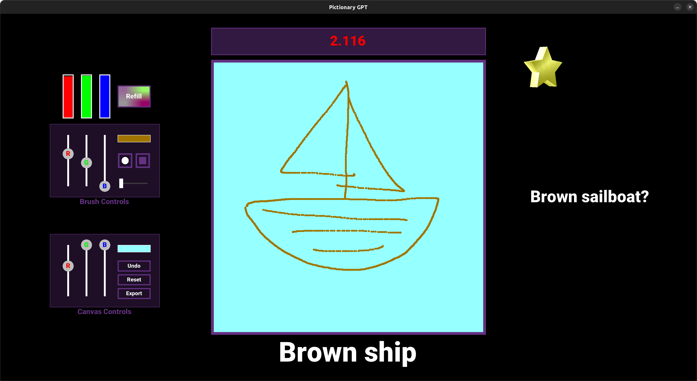  

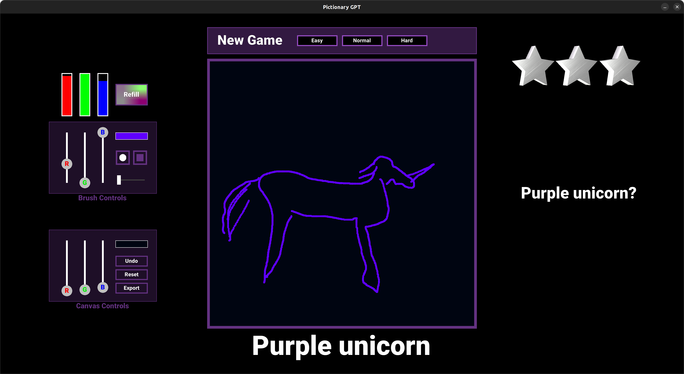  
